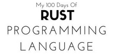

## My Progress
- [24 June 2022](https://github.com/ibrahimaji/100-days-of-rust/tree/main/00-installing_and_hello_cargo) - I learned how to install Rust in my machine and created "Hello World" using Rust. I installed Cargo, and tried several Cargo commands.
- [26 June 2022](https://github.com/ibrahimaji/100-days-of-rust/tree/main/01-programming_a_guessing_game) - Never thought it will be difficult! So much to learn, weird syntax as I am new in low level programming. But love this chapter as it teach me the practical small projects with breaking down small parts and show every Rust's features to handle these small parts of projects.
